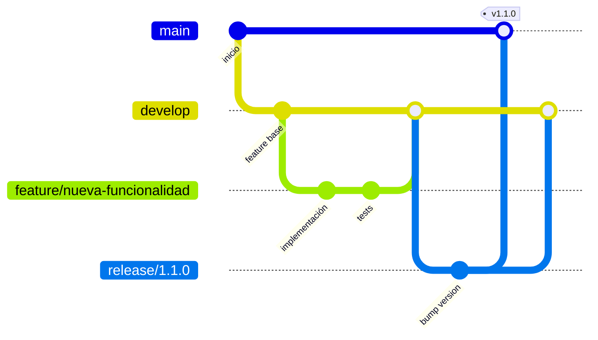
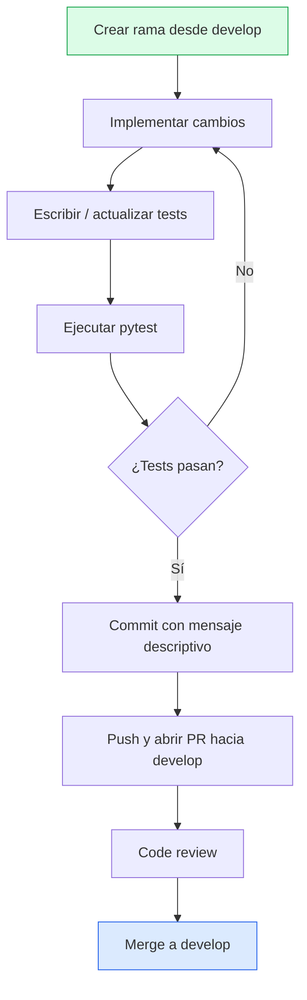

# Contribución

Gracias por tu interés en contribuir a `markdown-to-pdf`. Esta guía describe el flujo de trabajo y las convenciones del proyecto.

---

## Requisitos previos

```bash
# Clonar e instalar en modo desarrollo
git clone https://github.com/<tu-usuario>/markdown-to-pdf.git
cd markdown-to-pdf
pip install -e ".[test]"
markdown-to-pdf-setup
```

---

## Flujo de ramas



| Rama | Propósito |
|------|-----------|
| `main` | Versión estable y publicable |
| `develop` | Integración de features en progreso |
| `feature/<nombre>` | Desarrollo de una funcionalidad nueva |
| `fix/<nombre>` | Corrección de un bug |
| `release/<versión>` | Preparación de una versión nueva |

### Convenciones de nombres

- **Features**: `feature/soporte-epub`, `feature/tema-oscuro`
- **Fixes**: `fix/emoji-no-renderiza`, `fix/bookmark-duplicado`
- **Releases**: `release/1.1.0`

---

## Flujo de trabajo



1. Crear una rama desde `develop`.
2. Implementar los cambios.
3. Escribir tests que cubran la nueva funcionalidad o fix.
4. Verificar que toda la suite pasa: `pytest`.
5. Hacer commit con un mensaje descriptivo.
6. Abrir PR hacia `develop`.
7. Esperar review y aprobación.

---

## Estilo de código

### Python

- **Python 3.10+** — se permiten uniones `X | Y`, `match/case`, etc.
- Usar **type hints** en firmas de funciones públicas.
- Docstrings en funciones públicas (formato reStructuredText o una línea).
- Líneas de como máximo **100 caracteres** (flexible en literales largos).
- Imports agrupados: stdlib → terceros → proyecto (separados por línea en blanco).

### Nombres

| Elemento | Convención | Ejemplo |
|----------|-----------|---------|
| Módulos | `snake_case` | `math_rendering.py` |
| Funciones/métodos | `snake_case` | `render_heading()` |
| Funciones privadas | `_snake_case` | `_build_md_parser()` |
| Clases | `PascalCase` | `PdfFonts` |
| Constantes | `UPPER_SNAKE_CASE` | `COLOR_BODY` |

### Organización de módulos

- **Un módulo, una responsabilidad** — no mezclar PDF y Word en el mismo archivo.
- Los **colores, fuentes y tamaños** siempre van en `constants.py`, nunca hardcodeados.
- Los helpers OOXML de bajo nivel van en `word/ooxml.py`.

---

## Tests

```bash
# Suite completa
pytest

# Con cobertura
pytest --cov=markdown_to_pdf

# Un archivo específico
pytest tests/test_preprocessing.py -v

# Con output detallado
pytest -v --tb=short
```

### Convenciones de test

- Archivos: `tests/test_<módulo>.py`.
- Clases: `TestNombreDescriptivo`.
- Métodos: `test_<qué_verifica>`.
- Fixtures compartidos en `tests/conftest.py`.
- Tests que necesitan archivos generados deben usar `pytest.mark.skipif` si no están disponibles.

---

## Commits

Usar mensajes descriptivos en español o inglés, preferiblemente con el área afectada:

```
word: corregir renderizado de emoji en listas anidadas
pdf: añadir soporte para tablas con colspan
constants: agregar emoji de bandera
tests: cubrir caso de markdown vacío en Word
docs: actualizar diagrama de arquitectura
```

---

## Añadir dependencias

1. Agregar a `pyproject.toml` → `[project] dependencies`.
2. Agregar a `requirements.txt` con comentario descriptivo.
3. Si es solo para tests, usar `[project.optional-dependencies] test`.

---

## Checklist de PR

- [ ] Tests añadidos/actualizados y pasando (`pytest`).
- [ ] Constantes de estilo en `constants.py` (no hardcodeadas).
- [ ] Sin archivos temporales o de debug incluidos.
- [ ] `CHANGELOG.md` actualizado bajo `## [Unreleased]`.
- [ ] Documentación actualizada si es necesario (README, docs/).
