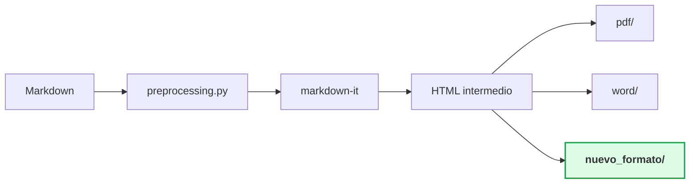

# Cómo añadir un nuevo formato de salida

Esta guía explica paso a paso cómo extender `markdown-to-pdf` para generar un nuevo formato de documento (por ejemplo, HTML estático, EPUB, presentación, etc.).

---

## Visión general



Todos los formatos comparten el mismo pipeline hasta el HTML intermedio. Tu nuevo formato solo necesita implementar la conversión desde ese HTML al formato final.

---

## Paso 1: Crear el sub-paquete

Crear una nueva carpeta dentro de `src/markdown_to_pdf/`:

```
src/markdown_to_pdf/
└── nuevo_formato/
    ├── __init__.py
    └── generator.py
```

### `__init__.py`

```python
from markdown_to_pdf.nuevo_formato.generator import generate_from_file

__all__ = ["generate_from_file"]
```

---

## Paso 2: Implementar el generador

El generador debe seguir el patrón establecido por los pipelines existentes:

```python
"""
Pipeline de generación para el nuevo formato.
"""
from __future__ import annotations

from pathlib import Path

import markdown_it
from mdit_py_plugins.dollarmath import dollarmath_plugin
from bs4 import BeautifulSoup

from markdown_to_pdf.preprocessing import preprocess_markdown
from markdown_to_pdf.constants import (
    # Importar las constantes de estilo que necesites
    COLOR_BODY,
    FONT_BODY_PT,
    HEADING_COLORS,
)


def _build_md_parser() -> markdown_it.MarkdownIt:
    """Configurar markdown-it con las extensiones necesarias."""
    md = markdown_it.MarkdownIt(
        "commonmark",
        {"html": True, "typographer": False, "breaks": False},
    )
    md.enable("table")
    dollarmath_plugin(md, allow_labels=True, allow_space=True,
                      allow_digits=True, double_inline=True)
    # Añadir custom render rules si es necesario
    return md


def generate(md_text: str):
    """Convertir Markdown a tu formato."""
    text = preprocess_markdown(md_text)
    parser = _build_md_parser()
    html = parser.render(text)
    soup = BeautifulSoup(html, "lxml")

    # Tu lógica de conversión aquí
    # ...


def generate_from_file(
    md_path: Path,
    output_path: Path | None = None,
) -> Path:
    """Leer un archivo Markdown y generar la salida."""
    suffix = ".ext"  # Cambiar por la extensión real
    if output_path is None:
        output_path = md_path.with_suffix(suffix)

    md_text = md_path.read_text(encoding="utf-8-sig")
    result = generate(md_text)

    # Guardar resultado
    # output_path.write_bytes(result) o similar

    print(f"  ✓ Archivo guardado → {output_path}")
    return output_path
```

---

## Paso 3: Registrar en el CLI

Editar `src/markdown_to_pdf/cli.py` para incluir la nueva opción:

```python
print("\n¿Qué formato desea generar?")
print("  1) PDF")
print("  2) Word (.docx)")
print("  3) Ambos (PDF + Word)")
print("  4) Nuevo formato")                     # ← Añadir
choice = input("  Seleccione [1/2/3/4]: ").strip()

# ...

if choice in ("4",):                             # ← Añadir
    from markdown_to_pdf.nuevo_formato.generator import generate_from_file
    generate_from_file(md_path)
```

---

## Paso 4: Usar constantes de estilo

La ventaja del diseño actual es que todos los colores, fuentes y tamaños están centralizados en `constants.py`. Usa los helpers según tu formato de salida:

| Tu formato necesita... | Usa |
|------------------------|-----|
| Colores CSS (`#1e293b`) | `rgb_hex(COLOR_BODY)` |
| Colores OOXML (`1E293B`) | `rgb_hex_upper(COLOR_BODY)` |
| Otro formato de color | Crear un nuevo helper en `constants.py` |

---

## Paso 5: Añadir tests

Crear `tests/test_nuevo_formato.py`:

```python
"""Tests para el nuevo formato de salida."""
from markdown_to_pdf.nuevo_formato.generator import generate


class TestNuevoFormato:
    def test_genera_output(self, sample_markdown):
        result = generate(sample_markdown)
        assert result is not None

    def test_input_vacío(self):
        result = generate("")
        assert result is not None
```

El fixture `sample_markdown` está definido en `tests/conftest.py` y contiene un Markdown con headings, listas, código, tablas, math y blockquotes.

---

## Paso 6: Documentar

1. Añadir la dependencia nueva (si la hay) a `pyproject.toml` → `dependencies`.
2. Actualizar `requirements.txt`.
3. Actualizar el árbol de estructura en `README.md`.
4. Actualizar el diagrama de pipeline en `docs/architecture.md`.

---

## Checklist

- [ ] Crear sub-paquete `src/markdown_to_pdf/nuevo_formato/`
- [ ] Implementar `generator.py` con `generate()` y `generate_from_file()`
- [ ] Reusar `preprocess_markdown()` y `_build_md_parser()`
- [ ] Importar constantes de estilo desde `constants.py`
- [ ] Registrar en `cli.py`
- [ ] Añadir tests en `tests/`
- [ ] Actualizar dependencias y documentación
