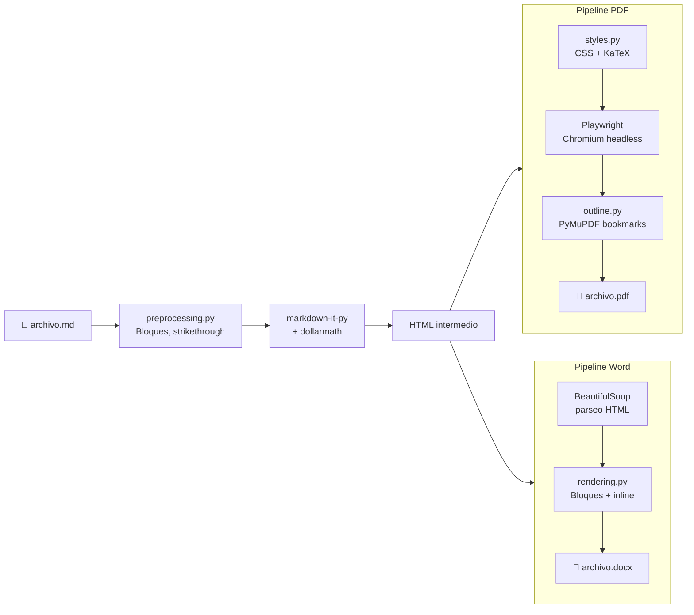
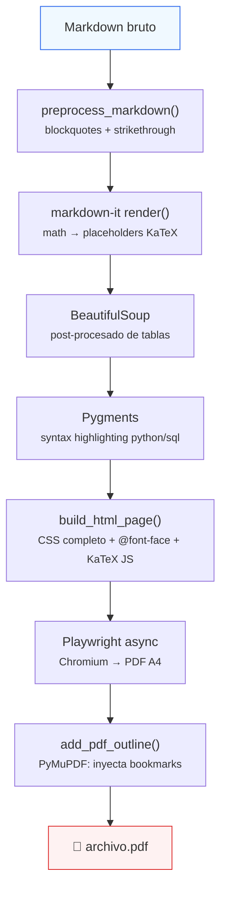
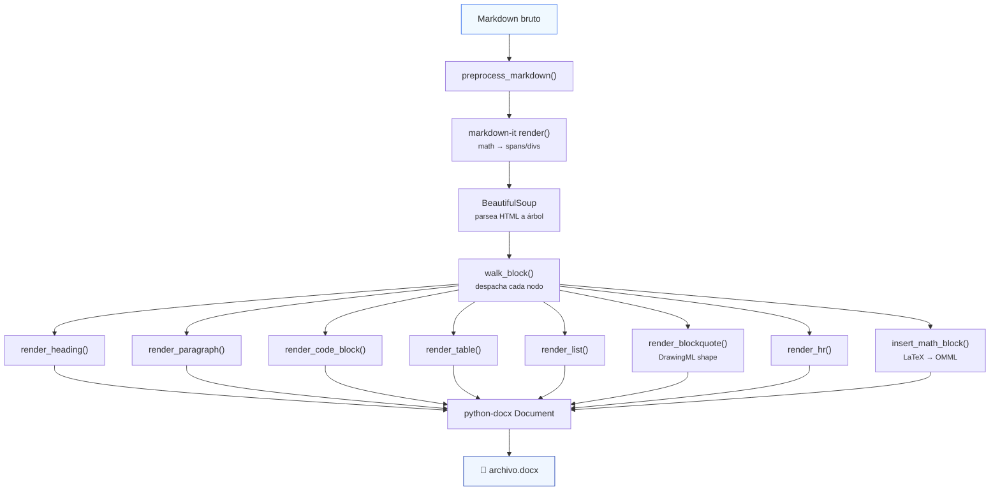
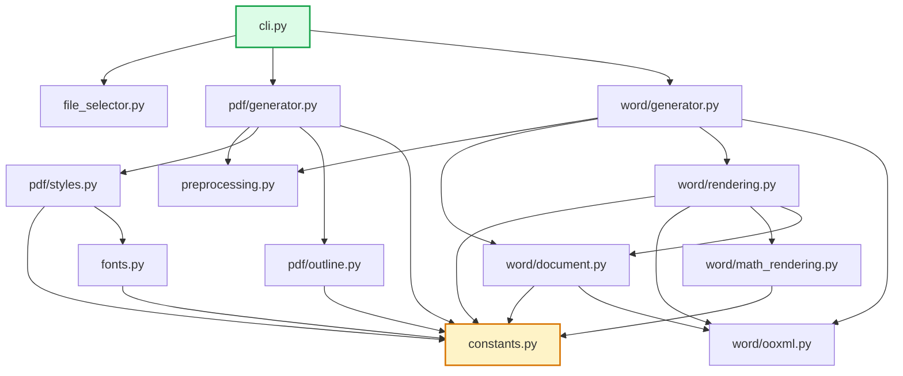
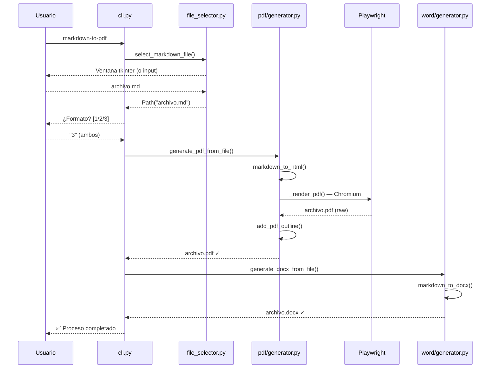

# Arquitectura del sistema

## Visión general

`markdown-to-pdf` transforma archivos Markdown en documentos PDF y Word con estilo corporativo. Ambos pipelines comparten el parsing inicial y el preprocesamiento, pero divergen en la fase de renderizado.

---

## Pipeline PDF en detalle

### Detalle de cada fase

| Fase | Módulo | Función principal | Qué hace |
|------|--------|-------------------|----------|
| 1. Preprocesamiento | `preprocessing.py` | `preprocess_markdown()` | Corrige listas en blockquotes, convierte `~~texto~~` a `<del>` |
| 2. Parsing | `pdf/generator.py` | `_build_md_parser()` | Configura markdown-it con tabla + dollarmath, custom render rules para math |
| 3. Post-procesado HTML | `pdf/generator.py` | `markdown_to_html()` | Añade `class="no-break"` a tablas, `colgroup` para anchos, syntax highlighting |
| 4. Template HTML | `pdf/styles.py` | `build_html_page()` | Envuelve el body con CSS completo, @font-face Inter, KaTeX auto-render |
| 5. Renderizado | `pdf/generator.py` | `_render_pdf()` | Playwright abre HTML → imprime PDF A4 con márgenes |
| 6. Bookmarks | `pdf/outline.py` | `add_pdf_outline()` | Extrae headings del HTML, inyecta TOC vía PyMuPDF |

---

## Pipeline Word en detalle

### Detalle de cada fase

| Fase | Módulo | Función principal | Qué hace |
|------|--------|-------------------|----------|
| 1. Preprocesamiento | `preprocessing.py` | `preprocess_markdown()` | Igual que PDF |
| 2. Parsing | `word/generator.py` | `_build_md_parser()` | markdown-it + dollarmath con render rules Word-específicas |
| 3. Árbol HTML | `word/generator.py` | `markdown_to_docx()` | BeautifulSoup parsea, `setup_document()` configura A4/márgenes/estilos |
| 4. Dispatch | `word/rendering.py` | `walk_block()` | Recorre nodos hijo del `<body>` y despacha al renderer correcto |
| 5. Inline | `word/rendering.py` | `inline_nodes_to_runs()` | Convierte HTML inline → Runs con formato (negrita, cursiva, emoji, links) |
| 6. Math | `word/math_rendering.py` | `latex_to_omml()` | LaTeX → MathML (latex2mathml) → OMML (Office XSLT) |
| 7. OOXML | `word/ooxml.py` | Múltiples helpers | Sombreado, bordes, indentación, bookmarks a nivel XML |

---

## Mapa de dependencias entre módulos

> **`constants.py`** (amarillo) es el nodo central — todos los módulos de estilo dependen de él.
> **`cli.py`** (verde) es el único punto de entrada del usuario.

---

## Flujo de ejecución del CLI

