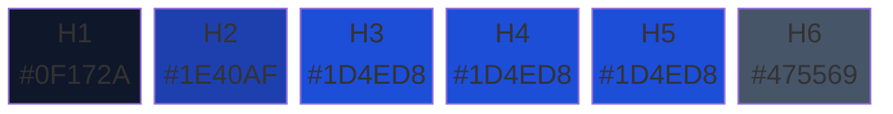

# Guía de estilos

Referencia completa de las variables de estilo definidas en `src/markdown_to_pdf/constants.py`. Todos los colores, fuentes y tamaños usados tanto en PDF como en Word se controlan desde este único archivo.

---

## Paleta de colores

Todos los colores se definen como tuplas `(R, G, B)` de enteros. Tres helpers los convierten al formato de cada backend:

| Helper | Formato | Uso |
|--------|---------|-----|
| `rgb_hex(color)` | `#1e293b` | CSS para PDF |
| `rgb_hex_upper(color)` | `1E293B` | Atributos OOXML directos |
| `rgb_docx(color)` | `RGBColor` | python-docx |

### Colores de encabezados



| Constante | RGB | Hex | Aplicación |
|-----------|-----|-----|------------|
| `COLOR_H1_TEXT` | `(15, 23, 42)` | `#0F172A` | Texto de H1 |
| `COLOR_H1_BORDER` | `(30, 64, 175)` | `#1E40AF` | Borde inferior de H1 |
| `COLOR_H2_TEXT` | `(30, 64, 175)` | `#1E40AF` | Texto de H2 |
| `COLOR_H2_BORDER` | `(191, 219, 254)` | `#BFDBFE` | Borde inferior de H2 |
| `COLOR_H3_TO_H5` | `(29, 78, 216)` | `#1D4ED8` | Texto de H3, H4 y H5 |
| `COLOR_H6_TEXT` | `(71, 85, 105)` | `#475569` | Texto de H6 |

### Colores del cuerpo

| Constante | RGB | Hex | Aplicación |
|-----------|-----|-----|------------|
| `COLOR_BODY` | `(30, 41, 59)` | `#1E293B` | Texto de párrafos |
| `COLOR_EM` | `(71, 85, 105)` | `#475569` | Texto en cursiva |
| `COLOR_LINK` | `(37, 99, 235)` | `#2563EB` | Hipervínculos |
| `COLOR_DEL` | `(107, 114, 128)` | `#6B7280` | Texto tachado |
| `COLOR_HR` | `(226, 232, 240)` | `#E2E8F0` | Líneas horizontales |

### Colores de código

| Constante | RGB | Hex | Aplicación |
|-----------|-----|-----|------------|
| `COLOR_CODE_BG` | `(241, 245, 249)` | `#F1F5F9` | Fondo de `inline code` |
| `COLOR_CODE_TEXT` | `(15, 23, 42)` | `#0F172A` | Texto de `inline code` |
| `COLOR_PRE_BG` | `(30, 32, 48)` | `#1E2030` | Fondo de bloques de código |
| `COLOR_PRE_TEXT` | `(200, 211, 245)` | `#C8D3F5` | Texto de bloques de código |

### Colores de blockquotes

| Constante | RGB | Hex | Aplicación |
|-----------|-----|-----|------------|
| `COLOR_BQ_BG` | `(239, 246, 255)` | `#EFF6FF` | Fondo del blockquote |
| `COLOR_BQ_BORDER` | `(37, 99, 235)` | `#2563EB` | Borde izquierdo |
| `COLOR_BQ_TEXT` | `(51, 65, 85)` | `#334155` | Texto dentro del blockquote |

### Colores de tablas

| Constante | RGB | Hex | Aplicación |
|-----------|-----|-----|------------|
| `COLOR_TH_BG` | `(30, 58, 138)` | `#1E3A8A` | Fondo de encabezados |
| `COLOR_TH_TEXT` | `(255, 255, 255)` | `#FFFFFF` | Texto de encabezados |
| `COLOR_TD_BORDER` | `(203, 213, 225)` | `#CBD5E1` | Bordes de celdas |
| `COLOR_TD_ALT_BG` | `(241, 245, 249)` | `#F1F5F9` | Filas alternas (zebra) |

---

## Fuentes

### PDF (fuentes embebidas)

| Clase | Atributo | Valor | Uso |
|-------|----------|-------|-----|
| `PdfFonts` | `BODY` | `Inter` | Texto de cuerpo |
| `PdfFonts` | `HEADING` | `Inter` | Encabezados |
| `PdfFonts` | `MONO` | `Consolas` | Código |
| `PdfFonts` | `MONO_ALT` | `Courier New` | Fallback monoespaciada |
| `PdfFonts` | `FALLBACK` | `Segoe UI` | Fallback general |

Las fuentes Inter se descargan como **woff2** desde jsDelivr y se embeben vía `@font-face` en el CSS. Los pesos disponibles son:

| Archivo | Peso | Estilo |
|---------|------|--------|
| `inter-latin-300-normal.woff2` | 300 (Light) | Normal |
| `inter-latin-400-normal.woff2` | 400 (Regular) | Normal |
| `inter-latin-400-italic.woff2` | 400 (Regular) | Italic |
| `inter-latin-500-normal.woff2` | 500 (Medium) | Normal |
| `inter-latin-600-normal.woff2` | 600 (SemiBold) | Normal |
| `inter-latin-700-normal.woff2` | 700 (Bold) | Normal |

### Word (fuentes del sistema)

| Clase | Atributo | Valor | Uso |
|-------|----------|-------|-----|
| `WordFonts` | `BODY` | `Segoe UI` | Texto de cuerpo |
| `WordFonts` | `HEADING` | `Calibri Light` | Encabezados |
| `WordFonts` | `MONO` | `Consolas` | Código |
| `WordFonts` | `EMOJI` | `Segoe UI Emoji` | Emoji con color |

> Las fuentes de Word dependen del sistema operativo. En Windows estos nombres están disponibles de forma nativa.

---

## Tamaños tipográficos

| Constante | Valor | Uso |
|-----------|-------|-----|
| `FONT_BODY_PT` | `10.5` | Tamaño base de texto de cuerpo |
| `FONT_CODE_PT` | `9.0` | Tamaño de código (inline y bloques) |
| `PARA_SPACING_PT` | `7` | Espacio después de párrafos |

### Encabezados

| Nivel | Tamaño (pt) | Negrita | Espacio antes (pt) | Espacio después (pt) |
|-------|-------------|---------|---------------------|----------------------|
| H1 | 22 | ✅ Sí | 0 | 8 |
| H2 | 14 | ❌ No | 24 | 8 |
| H3 | 12 | ❌ No | 18 | 6 |
| H4 | 11 | ❌ No | 14 | 5 |
| H5 | 11 | ❌ No | 10 | 4 |
| H6 | 10 | ✅ Sí | 10 | 4 |

---

## Mapa de emoji

El sistema soporta dos tipos de emoji con colorización automática:

### Emoji circulares → `●` (BLACK_CIRCLE)

Los emoji de círculos y cuadrados de color se renderizan como `●` con el color correspondiente. Esto garantiza consistencia visual en Word donde los emoji de color no siempre se ven bien.

| Emoji | Color | RGB |
|-------|-------|-----|
| 🔴 🟥 | Rojo | `(220, 38, 38)` |
| 🔵 🟦 | Azul | `(41, 99, 235)` |
| 🟠 🟧 | Naranja | `(234, 88, 12)` |
| 🟡 🟨 | Amarillo | `(202, 138, 4)` |
| 🟢 🟩 | Verde | `(22, 163, 74)` |
| 🟣 🟪 | Púrpura | `(124, 58, 237)` |
| 🟤 🟫 | Marrón | `(120, 53, 111)` |
| ⚫ | Negro | `(107, 114, 128)` |
| ⚪ | Blanco | `(209, 213, 219)` |

### Emoji con color asignado

Otros emoji comunes se renderizan con su glifo original pero con un color específico:

| Emoji | Color asignado | Ejemplo de uso |
|-------|---------------|----------------|
| ✅ ✔ | Verde | Estados positivos |
| ❌ ✖ 🚫 | Rojo | Estados negativos |
| ⚠ | Ámbar | Advertencias |
| ⚡ ⭐ 🏆 🔑 🔔 🌟 🔔 | Amarillo | Destacados |
| 🚀 📊 📝 💼 📋 🌐 🔄 🔍 ➡ | Azul | Acciones, datos |
| 💡 | Ámbar | Ideas |
| 📌 📍 💯 ❗ | Rojo | Alertas |
| 💰 📈 | Verde | Financiero positivo |
| 📉 | Rojo | Financiero negativo |

---

## Cómo personalizar estilos

### Cambiar un color

Editar la tupla en `constants.py`:

```python
# Antes: azul oscuro
COLOR_H1_TEXT = (0x0F, 0x17, 0x2A)

# Después: verde corporativo
COLOR_H1_TEXT = (0x00, 0x66, 0x44)
```

Ambos pipelines (PDF y Word) usarán el nuevo color automáticamente.

### Cambiar una fuente

```python
# Cambiar fuente de encabezados en Word
class WordFonts:
    HEADING = "Arial"  # era "Calibri Light"
```

Para PDF, la fuente debe estar disponible como woff2 embebida o como fuente del sistema en Chromium.

### Añadir un nivel de heading personalizado

Los diccionarios `HEADING_SIZE`, `HEADING_BOLD`, `HEADING_COLORS`, `HEADING_SPACE_BEFORE` y `HEADING_SPACE_AFTER` se indexan por nivel (1-6). Modificar cualquier valor cambia ambos backends.

### Añadir emoji personalizados

Agregar entradas a `CIRCLE_EMOJI` o `EMOJI_COLOR`:

```python
# Nuevo emoji con color personalizado
EMOJI_COLOR["\U0001F4E6"] = (0x8B, 0x5C, 0xF6)  # 📦 package → violeta
```
